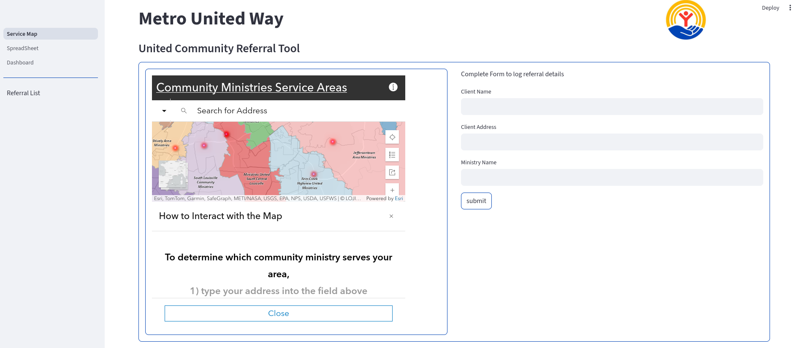

# United Community Referral Tool

The purpose of this application to to utilize the [Community Ministries Service Areas](https://cfn.maps.arcgis.com/apps/instant/lookup/index.html?appid=ffdde7dd21cd4fcabcdf33e01f95e747]) ArcGIS mapping tool as a component in a simple web application to streamline volunteer work connecting at risk populations with applicable ministries and assistance resources local to the Louisville KY metropolitan area.

## Tooling
1. [Streamlit](https://docs.streamlit.io/) for UI development.
2. [gsheets-connection](https://github.com/streamlit/gsheets-connection) for streamlined connection to Google Sheets. Based on [Gspread](https://docs.gspread.org/en/v6.1.4/).
3. [Google Sheets](https://workspace.google.com/products/sheets/) for backend. Yes you read that right.
4. [Heroku](https://www.heroku.com/) will be used for hosting, as well as devops.
5. [Heroku Postgres](https://devcenter.heroku.com/articles/heroku-postgresql) for data backup and disaster recovery.

## Requirements
1. Access to the  [Community Ministries Service Areas](https://cfn.maps.arcgis.com/apps/instant/lookup/index.html?appid=ffdde7dd21cd4fcabcdf33e01f95e747]) map is critical. This must be directly integrated into the application, either as an embed, or by programattically retrieving metadata.
2. Users must be able to input data into a Form of some kind, and have those submissions populate data into a persistant location which is easily accessed and intuitive to consume.
3. Compiled data must be in spreadsheet format to cater to common expectations across audiences for working with data. This must be simple.
4. Data must be editable after being created, these changes must persist to the source dataset. Basic [CRUD](https://en.wikipedia.org/wiki/Create,_read,_update_and_delete) operations must be supported.
5. Application must have a rudimentary dashboard summarizing basic stats, such as current open referral counts, service types, and time spent open.

